## blog_django
### Первый большой проект на Django
[ссылка на готовый продукт](https://trueget.pythonanywhere.com)

### Структура проекта
```
blog_django
├── web_site
    ├── blog
    ├── user_page
    ├── users
    ├── web_site
    ├── db_blog.sqlite3
    └── manage.py
├── .env
├── .gitignore
├── README.md
└── requirements.txt
```


### Описание приложения

В блоге присутствует регистрация пользователя, без авторизации функционал будел слегка ограничен.
Страницы регистрации, авторизации и подтверждения регистрации:

Страница регистрации:
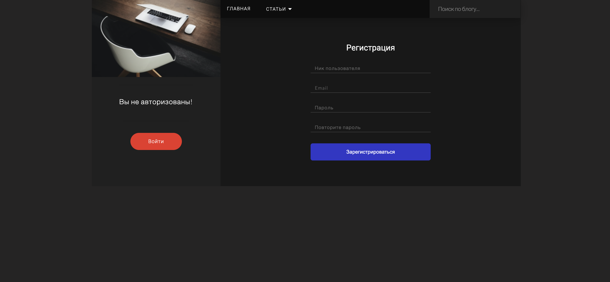
Страница подтверждения регистрации:
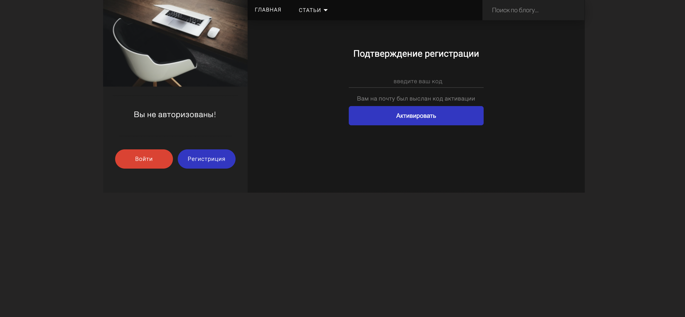
Страница авторизации:
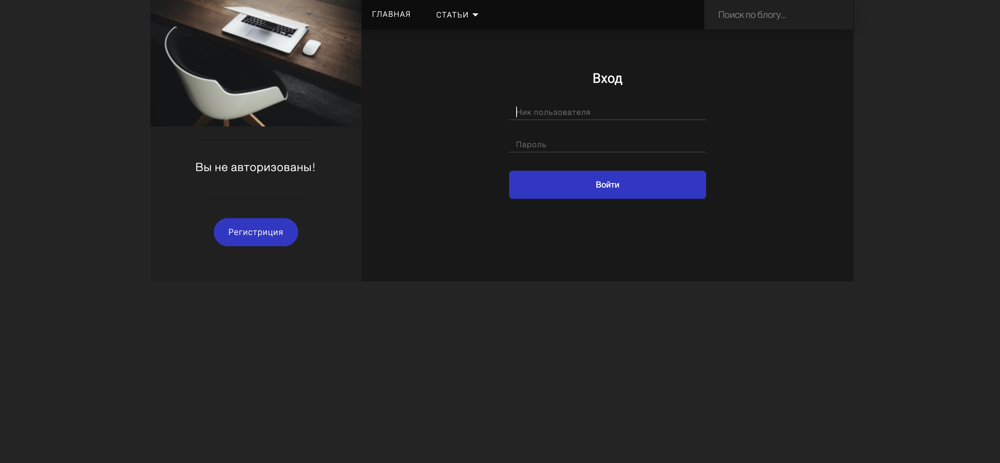

Без авторизации функционал ограничен: вы можете только просматривать статью, просматривать страницу авторов, доступен поиск по ключевым словам и доступен выбор раздела статтей, доступна функция поиска по ключевому слову:

Страница пользователя без авторизации:
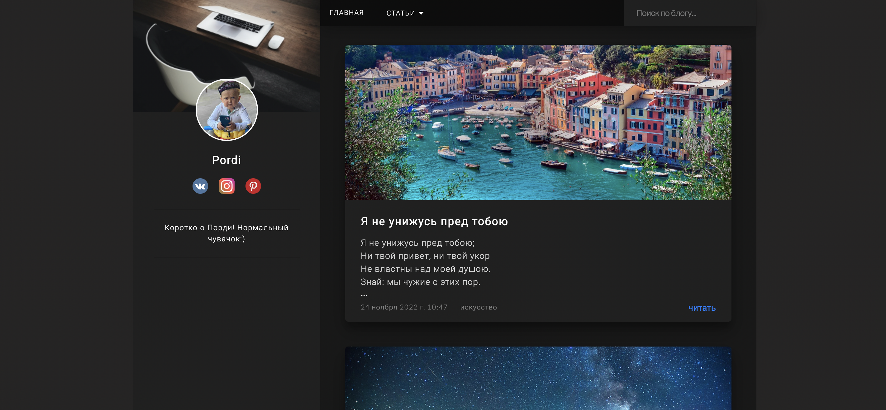
Поиск статьи по ключевому слову:

Выбор раздела статьи:
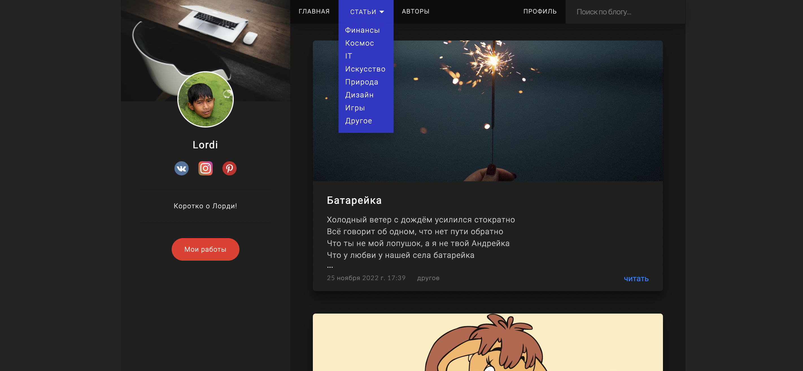
Link share:
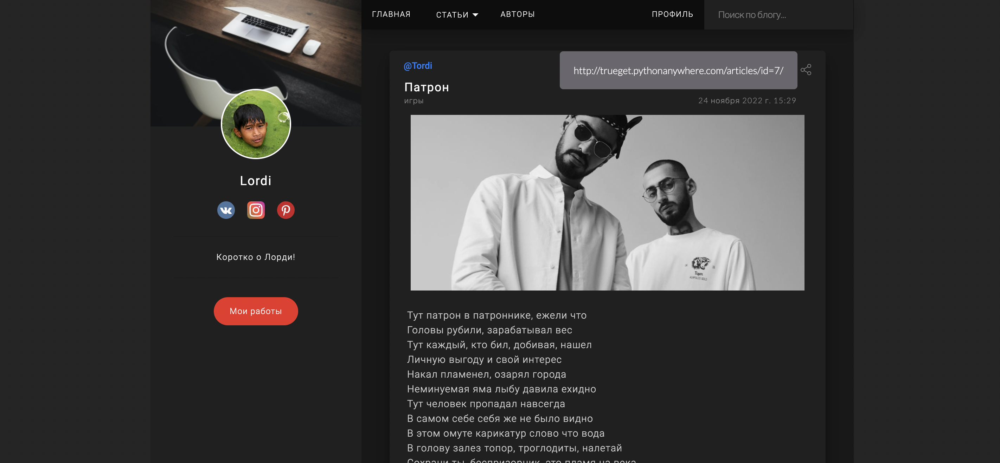

После авторизации у вас появляется возможность: опубликовать статью, комментировать, ставить лайк, изменять свой профиль:

Главная страница с авторизованым пользователем:
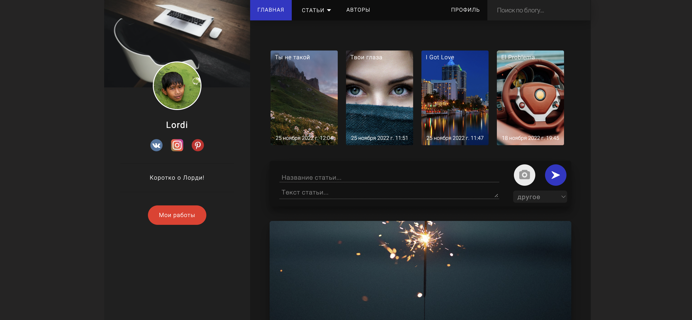
Страница чужого пользователя:

Изменить свой профиль:
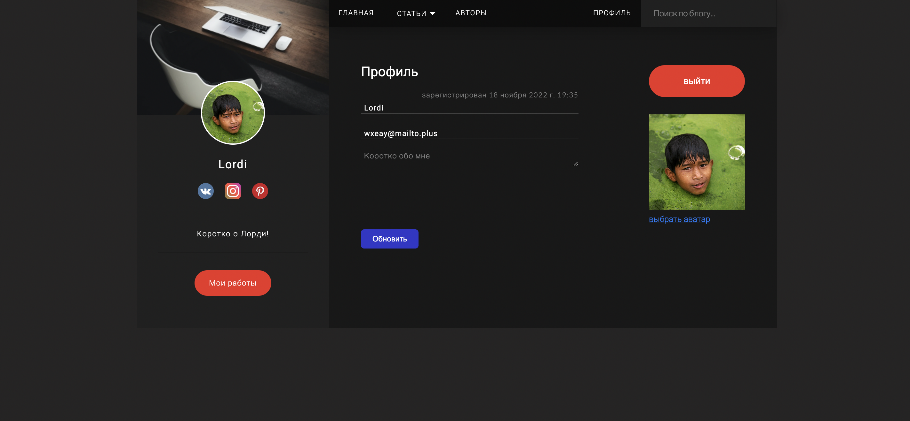
Все авторы:
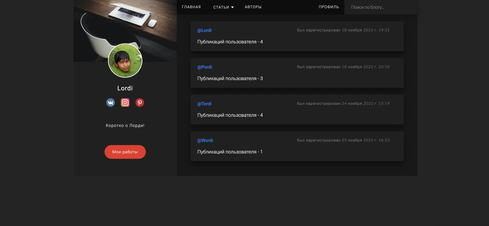
Страница одной публикации: информация о статье:
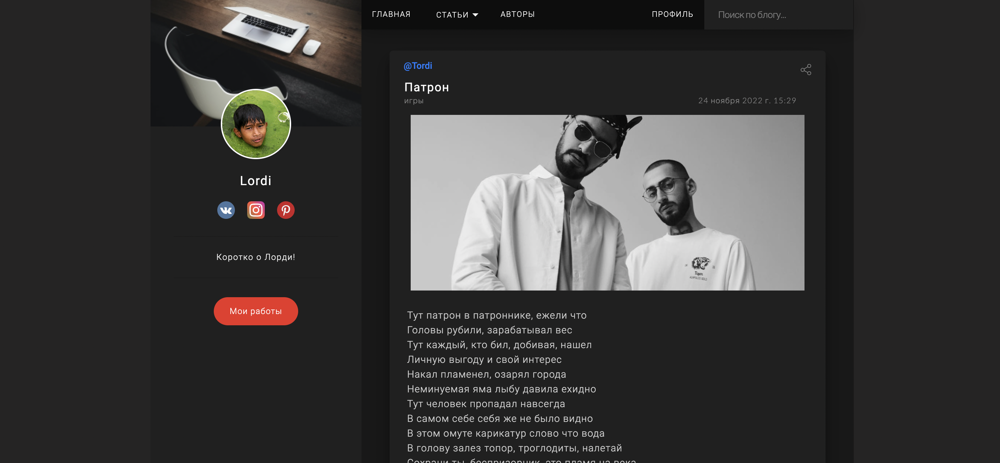
Страница одной публикации: лайки, просмотры и комментарии:
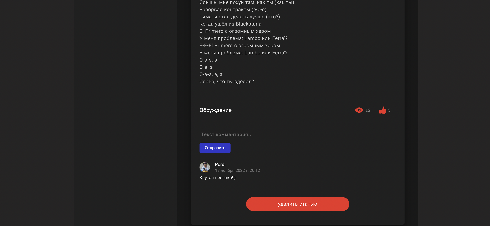

<br>
<h3>Для запуска приложения:</h3>
<ul>
    <li>скачайте либо клонируйте репозиторий с проектом</li>
    <li>установите зависимости через requirements</li>
    <li>создайтк бд в папке web_site где находится файл запуска manage.py</li>
    <li>сделайте миграцию моделей</li>
    <li>создайте суперюзера</li>
    <li>в файле setting главного приложения проекта, вам необходимо установить ваши значения в SECRET_KEY, EMAIL_HOST_USER, EMAIL_HOST_PASSWORD. так как мои значения храняться в переменных окружения.</li>
    <li>запустить приложение</li>
</ul>
